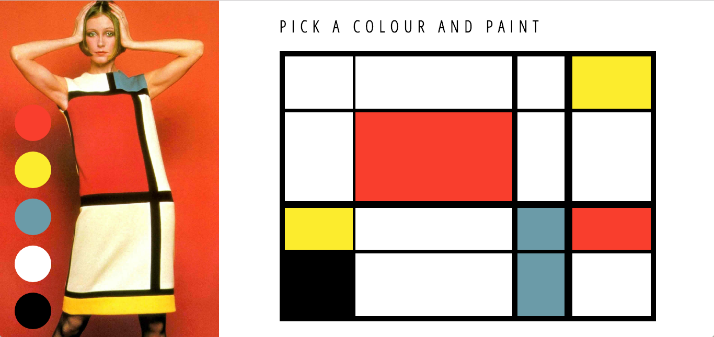

## Introduction
Ever wanted to paint like a Dutch pioneer of abstract art in a non-representational form termed neoplasticism? Well, look no further. Behond, the Paint a Mondrian app. Simply pick your colour of choice and paint. 🎨



## Instructions
Click [here] (https://sity-mondrian.herokuapp.com/) to explore it online.

To install and use locally:
```
$ git clone git@github.com:sitypop/paint_a_mondrian.git
$ cd paint_a_mondrian
$ node bin/http-server
```
Then open your browser, visit `http://localhost:8080`.

## Tools used
* JQuery
